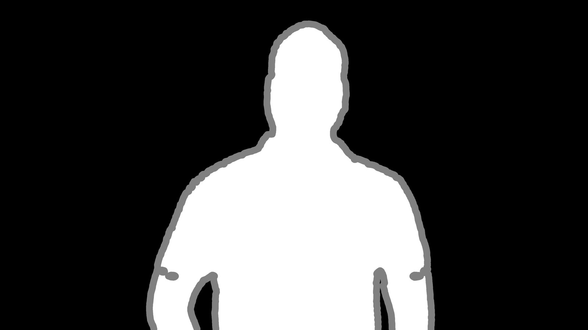
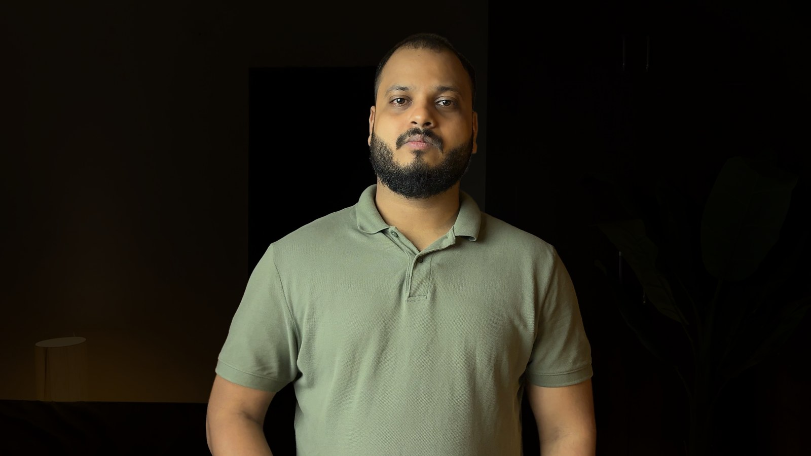
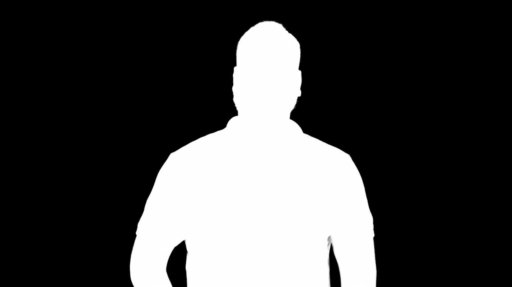
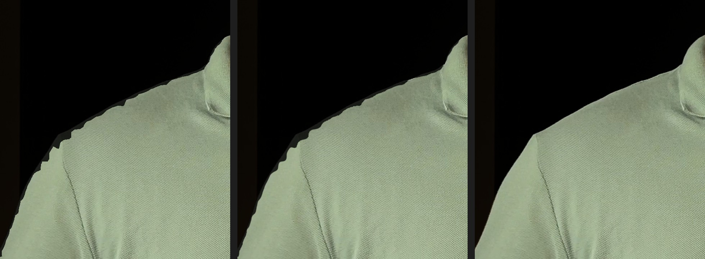

# The matte-edge problem — how Apelles isolates a subject

*Worklog, 2026-09-01. The reasoning behind [D-016](../../08-decisions.md#d-016).*

This is the feature that started the whole project — the **"hands problem"**: in Palmier
(and every ellipse/rectangle masking tool) you cannot draw a mask that hugs a body. Splay
your forearms out and they fall into "background" and get darkened with it. Apelles' answer
is a real per-subject matte. Getting that matte *clean* took three tries.

The test frame is a 4K (3840×2160) Rec.709 talking-head still, deliberately underexposed —
a dim sage polo against a near-black room. Low edge contrast, worst case.

| | |
|---|---|
|  | The source frame. |

---

## Try 1 — SAM 2 alone

`ultralytics` SAM 2.1 (small), prompted with a YOLO person box. It nails *what* to select —
whole body, arms, hair — in ~400 ms.


But zoom into the shoulder and there's a **~15 px staircase**. SAM 2's mask decoder runs at
256×256 internally; upscale that to 4K and every boundary pixel becomes a 15 px block. A
bigger SAM model (base, large) does **not** fix this — they all share the same 256 px
decoder. Bigger helps *what* it selects, not *how sharp* the edge is.

Meta's own web demo hides this by only ever showing the result small.

## Try 2 — segmentation + "Matte Finesse" (what Resolve's Magic Mask does)

DaVinci Resolve's Magic Mask is a segmentation net plus a finesse stack: clean black/white,
choke/spread, blur, and an edge-aware refine. So we built the same: region clean → a
**guided filter** (edge-preserving, source luma as the guide) → level clip → feather.


On a high-contrast edge this works. On *this* shot it doesn't — the shirt-vs-background
luma difference is too small for the guided filter to lock onto, so the staircase survives
a "crisp" tune and a "soft" tune just turns it into visible blur. This is a real limitation
of finesse-only pipelines; Resolve colorists hit it too and reach for a qualifier or hand
roto on hero shots.

## Try 3 — trimap → ViTMatte (what Adobe's "Refine Edge" does)

The missing stage is a **matting model**. Take SAM's coarse mask, erode it for
definite-foreground, dilate it for definite-background, and the band between the two is
"unknown":



Then run **ViTMatte** (`vitmatte-small`, ~100 MB) over just that unknown band. It predicts a
true alpha from the image detail — not morphology, not blur.





The edge now follows the actual garment line. Crisp, no steps, no halo.

### The three, side by side (shoulder, 100%)

`coarse SAM` · `finesse` · `ViTMatte`



---

## The pipeline Apelles ships

```
YOLO person box  →  SAM 2.1  →  trimap (erode/dilate)  →  ViTMatte  →  alpha
   ~40 ms            ~400 ms       ~1 ms                    ~2.8 s
```

Runs in the `ai/` Python sidecar on Apple GPU (MPS), fully local, no network, no API.
`/segment` returns the refined alpha by default; `refine: false` returns the raw SAM mask.

**Why this and not the alternatives**

- *Bigger SAM* — same 256 px decoder, doesn't touch edge sharpness.
- *SAM-HQ / HQ-SAM2* — would help, but it's a heavier model and still not a true alpha.
- *RobustVideoMatting standalone* — person-only, no arbitrary selections, and it doesn't
  take a prompt. SAM + ViTMatte keeps "select anything by box or click" and adds the clean
  edge on top.
- *Guided-filter finesse alone* — shown above; fails on low-contrast edges.

The lesson: **segmentation answers *what*, matting answers *where exactly*.** Every serious
tool does both — Resolve leans on finesse, Adobe's Roto Brush pairs with Refine Edge. Apelles
pairs SAM with ViTMatte.
